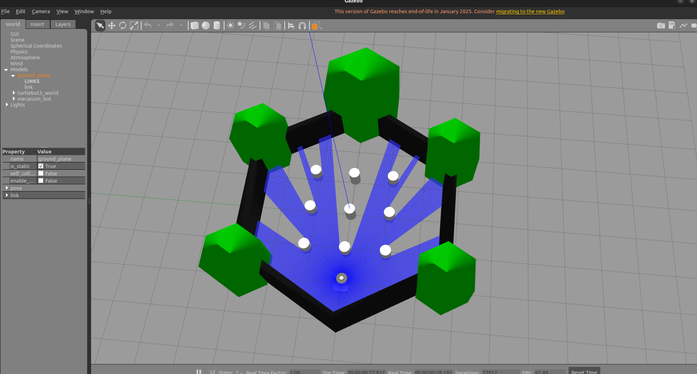
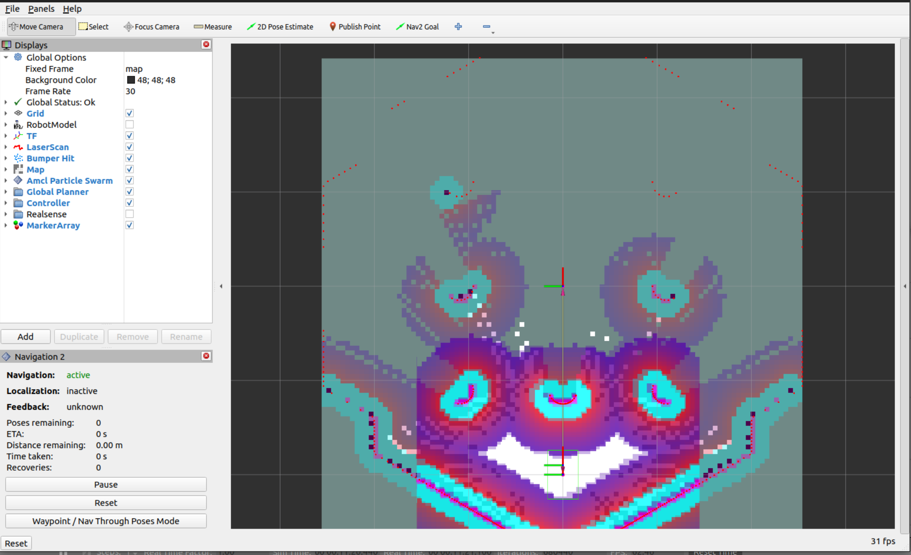

# Autonomous Mobile Robot (AMR)

This package (`robot_gazebo`) contains the simulation environment and autonomous navigation stack for a custom rack-checking AMR. The robot features an omnidirectional mecanum drive, 2D LiDAR, and a highly tuned Nav2 stack capable of dynamic obstacle avoidance and autonomous frontier exploration. 

It is pre-configured to run in **Gazebo** but is fully compatible with **NVIDIA Isaac Sim** via the ROS 2 OmniGraph bridge.

##  Dependencies

This project is built on **ROS 2 Humble**. Ensure you have the ROS 2 Humble desktop version installed before proceeding.

You will need the following ROS 2 packages to run the full simulation, mapping, and navigation stack:
```bash
sudo apt update
sudo apt install ros-humble-navigation2 \
                 ros-humble-nav2-bringup \
                 ros-humble-slam-toolbox \
                 ros-humble-explore-lite \
                 ros-humble-nav2-collision-monitor \
                 ros-humble-gazebo-ros-pkgs
```
##  Building the Workspace

Clone this repository into your ROS 2 workspace `src` directory, then build and source it. *(Using `--symlink-install` is highly recommended so YAML configuration changes take effect without needing to rebuild).*
```bash
cd ~/AMR_ws
colcon build --symlink-install
source install/setup.bash
```


---

##  How to Run the Simulation (Gazebo)

The workflow is split into bringing up the physical simulation and launching the software "brain" (Nav2).

### 1. Launch the World and Robot
In your first terminal, launch Gazebo with the warehouse world and spawn the mecanum AMR:
```bash
ros2 launch robot_gazebo spawn_robot.launch.py
```


### 2. Launch the Navigation Stack
Open a second terminal, source your workspace, and choose **one** of the following operating modes:

#### Mode A: Autonomous Exploration (Mapping)
Use this mode in a new, unmapped environment. The robot will use `explore_lite` to autonomously drive to unknown frontiers and map the entire area using SLAM Toolbox.
```bash
ros2 launch robot_gazebo Exploration.launch.py
```


#### Mode B: Standard Navigation (Pre-mapped)
Use this mode if you already have a saved map and simply want to send the robot to specific coordinates (e.g., specific warehouse racks) using RViz or an action client.
```bash
ros2 launch robot_gazebo navigation.launch.py
```
---

##  Saving the Generated Map

Once the robot has finished exploring the environment using `Exploration.launch.py`, you can save the map to a file. 


```bash
ros2 run nav2_map_server map_saver_cli -f my_warehouse_map --ros-args -p use_sim_time:=true
```


---

##  Connecting to NVIDIA Isaac Sim

This Nav2 stack is hardware-agnostic. To run this navigation stack using an NVIDIA Isaac Sim robot (like the Clearpath Ridgeback or Fraunhofer O3dyn) instead of Gazebo, your Isaac Sim **Action Graph (OmniGraph)** must act as the bridge.

Ensure your Isaac Sim graph contains the following ROS 2 nodes to satisfy Nav2's requirements:

1. `ROS 2 Publish Clock` (Set to "Read Sim Time"). *Crucial to prevent TF dropouts.*
2.  `ROS 2 Publish Odometry` -> `ROS 2 Publish Raw Transform Tree` (Computes and broadcasts `odom` -> `base_link`).
   - `ROS 2 Publish Transform Tree` (Broadcasts static sensor offsets like `base_link` -> `lidar_link`).
3.  `ROS 2 Publish LaserScan` (Attached to a PhysX Lidar on the robot).
4.  `ROS 2 Subscribe Twist` (Listening to `/cmd_vel` or `/cmd_vel_safe`). Wire the Y-axis (linear.y) output directly into your mecanum/holonomic wheel controllers to enable strafing.

Once the Isaac Sim graph is playing, simply run `ros2 launch robot_gazebo navigation.launch.py` in your terminal. Nav2 will connect to Isaac Sim exactly as it does to Gazebo.
