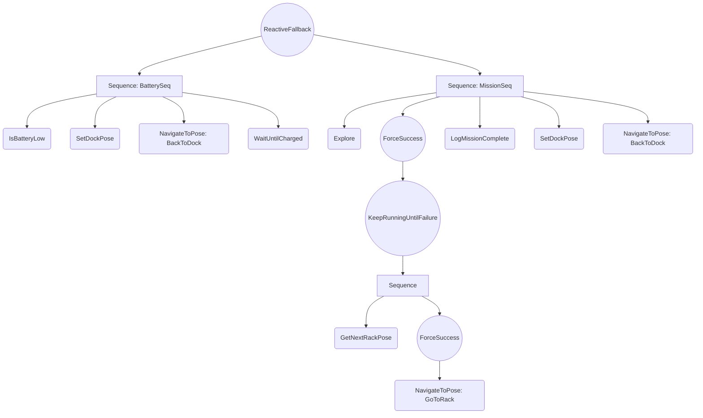

# Autonomous Mobile Robot (AMR)

This package contains the simulation environment and autonomous navigation stack for a custom AMR. The robot features an omnidirectional mecanum drive, 2D LiDAR, and a highly tuned Nav2 stack capable of dynamic obstacle avoidance and autonomous frontier exploration, orchestrated by a robust Behavior Tree mission system.

It is pre-configured to run in **Gazebo** but is fully compatible with **NVIDIA Isaac Sim** via the ROS 2 OmniGraph bridge.

## Dependencies

This project is built on **ROS 2 Humble**. Ensure you have the ROS 2 Humble desktop version installed before proceeding.

You will need the following ROS 2 packages to run the full simulation, mapping, and navigation stack:
```bash
sudo apt install ros-humble-navigation2 \
                 ros-humble-nav2-bringup \
                 ros-humble-slam-toolbox \
                 ros-humble-nav2-collision-monitor \
                 ros-humble-gazebo-* \
                 ros-humble-behaviortree-cpp-v3
```

## Building the Workspace

Clone this repository into your ROS 2 workspace `src` directory, then build and source it. *(Using `--symlink-install` is highly recommended so Python script changes take effect without needing to rebuild).*
```bash
cd ~/AMR_ws
colcon build --symlink-install
source install/setup.bash
```

---

## Tutorial: Running the Full Autonomous Warehouse Mission

The core feature of this AMR is its fully autonomous warehouse mission. In this mission, the robot explores the warehouse, generates a map, detects storage racks using computer vision, navigates to each rack for inspection, and finally returns to its docking station.

*(See the mission in action below!)*
<br>

<br>
*Figure 1: Animated demo of the mecanum robot inspecting cylindrical storage racks autonomously.*
<br>

To run this complete mission, you will need to open **four separate terminals** and run the following commands in order. *(Remember to run `source install/setup.bash` in every new terminal!)*

### 1. Launch the Core Simulation and Navigation Stack
This master launch file brings up Gazebo, spawns the mecanum AMR, and starts both SLAM Toolbox and Nav2.
```bash
ros2 launch robot_gazebo Core_Navigation.launch.py
```

<br>
*Figure 2: The TurtleBot3 warehouse environment loaded in Gazebo Classic.*
<br>

<br>
*Figure 3: RViz2 visualizing the Nav2 costmaps and the active SLAM occupancy grid.*

### 2. Launch the Behavior Tree Mission Executor
This C++ node orchestrates the entire mission sequence. It handles battery monitoring, automatically launches `explore_lite` for exploration, and sequentially handles rack navigation. It will immediately start executing the BT.
```bash
ros2 run robot_Behavior robot_behavior
```

<br>
*Figure 4: The 2D occupancy grid map generated by SLAM Toolbox, before being processed by OpenCV.*

### 3. Run the Map Operations (CV Rack Detection)
This node runs in the background. It waits for the BT to finish exploring and save the map. Once the map is saved, it uses OpenCV to detect all the storage racks on the map and publishes their coordinate waypoints back to the BT.
```bash
ros2 run robot_navigation map_operations
```


---

## Detailed Node & Launch File Reference

Here is a breakdown of the individual components we used to build the autonomous system:

### `Core_Navigation.launch.py`
**Purpose**: The master launch file for the entire architecture.
**What it does**: Instead of launching everything separately, this file seamlessly groups the Gazebo world loading (`turtlebot3_world.world`), parses the URDF to spawn the custom mecanum robot, launches `slam_toolbox` in online_async mode for real-time occupancy grid mapping, and boots up the `nav2_bringup` stack alongside RViz2.

### `robot_world.launch.py` & `Exploration.launch.py`
**Purpose**: Modular launch files.
**What they do**: These exist if you prefer to launch the system component-by-component. `robot_world.launch.py` strictly brings up the simulator and robot, while `Exploration.launch.py` brings up SLAM, Nav2, and `explore_lite`. For the main tutorial mission, `Core_Navigation.launch.py` supersedes them both.

### `robot_behavior` (Behavior Tree Node)
**Purpose**: The central mission "Brain".
**What it does**: Parses `warehouse_operation.xml` using `behaviortree_cpp_v3`. It manages a reactive sequence that constantly checks the battery. Its main sequence launches `explore_lite` natively in C++, waits for exploration to finish, waits for the `map_operations` node to send it a list of rack coordinates, loops through those coordinates using Nav2, and then navigates back to the origin dock pose.

**Mission Logic Tree**:

```mermaid
graph TD
    Root((ReactiveFallback))
    
    %% Battery Interrupt Branch (High Priority)
    Root --> BatterySeq[Sequence: BatterySeq]
    BatterySeq --> IsBatteryLow(IsBatteryLow)
    BatterySeq --> SetDockPose1(SetDockPose)
    BatterySeq --> BackToDock1(NavigateToPose: BackToDock)
    BatterySeq --> WaitUntilCharged(WaitUntilCharged)
    
    %% Main Mission Branch (Normal Priority)
    Root --> MissionSeq[Sequence: MissionSeq]
    MissionSeq --> Explore(Explore)
    MissionSeq --> FS1((ForceSuccess))
    FS1 --> KR((KeepRunningUntilFailure))
    KR --> RackSeq[Sequence]
    RackSeq --> GetNextRackPose(GetNextRackPose)
    RackSeq --> FS2((ForceSuccess))
    FS2 --> GoToRack(NavigateToPose: GoToRack)
    
    %% Final Docking Sequence
    MissionSeq --> LogMissionComplete(LogMissionComplete)
    MissionSeq --> SetDockPose2(SetDockPose)
    MissionSeq --> BackToDock2(NavigateToPose: BackToDock)
```

### `map_operations.py`
**Purpose**: Computer vision and waypoint generation.
**What it does**: Reads the `.yaml` and `.pgm` map files generated by SLAM. It applies OpenCV thresholds and area filters (excluding small noise and large outer walls) to isolate the storage racks. It then transforms the pixel coordinates into real-world ROS coordinates, applies a 0.55m offset to keep the robot safely in the aisle, calculates a quaternion to make the robot face the rack (+Y axis), and publishes a `PoseArray` to the BT.

### `battery_dummy`
**Purpose**: Simulates hardware state.
**What it does**: Publishes a `sensor_msgs/BatteryState` message to `/battery_level` at 1Hz, decreasing the percentage slowly to trigger the Behavior Tree's `IsBatteryLow` condition node.

---

## Connecting to NVIDIA Isaac Sim

This Nav2 stack is hardware-agnostic. To run this navigation stack using an NVIDIA Isaac Sim robot instead of Gazebo, your Isaac Sim **Action Graph (OmniGraph)** must act as the bridge.

Ensure your Isaac Sim graph contains the following ROS 2 nodes to satisfy Nav2's requirements:

1. `ROS 2 Publish Clock` (Set to "Read Sim Time"). *Crucial to prevent TF dropouts.*
2.  `ROS 2 Publish Odometry` -> `ROS 2 Publish Raw Transform Tree` (Computes and broadcasts `odom` -> `base_link`).
   - `ROS 2 Publish Transform Tree` (Broadcasts static sensor offsets like `base_link` -> `lidar_link`).
3.  `ROS 2 Publish LaserScan` (Attached to a PhysX Lidar on the robot).
4.  `ROS 2 Subscribe Twist` (Listening to `/cmd_vel`). Wire the Y-axis (linear.y) output directly into your mecanum wheel controllers to enable strafing.

---

## Acknowledgments & Citations

This project builds upon the incredible work of the open-source robotics community. We would like to acknowledge and cite the following projects that made this possible:

- **Nav2 (Navigation2)**: Macenski, S., et al. "The Marathon 2: A Navigation System". 2020. [Nav2 GitHub](https://github.com/ros-planning/navigation2)
- **SLAM Toolbox**: Macenski, S., Campanile, I. "SLAM Toolbox". 2019. [SLAM Toolbox GitHub](https://github.com/SteveMacenski/slam_toolbox)
- **BehaviorTree.CPP**: Faconti, D. "BehaviorTree.CPP v3". [BehaviorTree.CPP GitHub](https://github.com/BehaviorTree/BehaviorTree.CPP)
- **TurtleBot3 Simulation World**: ROBOTIS Co., Ltd. [TurtleBot3 Simulations](https://github.com/ROBOTIS-GIT/turtlebot3_simulations)
- **m-explore-ros2 (`explore_lite`)**: [m-explore-ros2 GitHub](https://github.com/robo-friends/m-explore-ros2)
