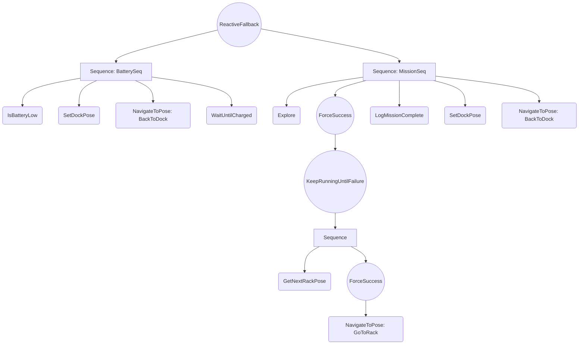

# Autonomous Mobile Robot (AMR) Architecture

This package contains the simulation environment, autonomous navigation stack, and mission orchestration for a custom Autonomous Mobile Robot (AMR). The robot features an omnidirectional mecanum drive, 2D LiDAR, and a highly tuned Nav2 stack capable of dynamic obstacle avoidance and autonomous frontier exploration. The entire warehouse logistics mission is seamlessly orchestrated by a robust Behavior Tree (BT.CPP).

It is pre-configured to run in **Gazebo** but is fully compatible with **NVIDIA Isaac Sim** via the ROS 2 OmniGraph bridge.

> **Branches:** `main` targets **ROS 2 Humble** (Gazebo Classic + BehaviorTree.CPP v3), exactly as below.
> `jazzy` targets **ROS 2 Jazzy** (new Gazebo "Harmonic"/gz sim + BehaviorTree.CPP v4) — see
> [Notes for the `jazzy` branch](#notes-for-the-jazzy-branch) at the bottom for what changed and
> what to double-check, since it hasn't been built/run against a live Jazzy install yet.

---

## System Dependencies

This architecture is built on **ROS 2 Humble**. Ensure you have the ROS 2 Humble desktop version installed before proceeding.

You will need the following ROS 2 packages to run the full simulation, mapping, and navigation stack:
```bash
sudo apt install ros-humble-navigation2 \
                 ros-humble-nav2-bringup \
                 ros-humble-slam-toolbox \
                 ros-humble-nav2-collision-monitor \
                 ros-humble-gazebo-* \
                 ros-humble-behaviortree-cpp-v3 \
                 ros-humble-rosbridge-suite
```

## Workspace Setup

Clone this repository into your ROS 2 workspace `src` directory, then build and source it. *(Using `--symlink-install` is highly recommended so Python script changes take effect without needing to rebuild).*
```bash
cd ~/AMR_ws
colcon build --symlink-install
source install/setup.bash
```

---

## Running the Autonomous Warehouse Mission (Without Web GUI)

The core feature of this AMR is its fully autonomous warehouse mission. The robot explores the warehouse, maps the environment, detects storage racks using computer vision, navigates to each rack for inspection, and finally returns to its docking station.

To run this complete mission manually from the terminal, you will need to open **three separate terminals** and run the following commands in order. *(Remember to run `source install/setup.bash` in every new terminal!)*

### 1. Core Simulation and Navigation Stack
This master launch file brings up Gazebo, spawns the mecanum AMR, and starts both SLAM Toolbox and Nav2.
```bash
ros2 launch robot_gazebo Core_Navigation.launch.py
```
<p align="center">
  
  
</p>
<p align="center"><i>Left: TurtleBot3 warehouse environment in Gazebo. Right: RViz2 visualizing Nav2 costmaps and SLAM.</i></p>

### 2. Behavior Tree Mission Executor
This C++ node orchestrates the mission sequence. It manages battery monitoring, launches `explore_lite` for exploration, and sequentially handles rack navigation.
```bash
ros2 run robot_Behavior robot_behavior
```
<p align="center">
  
</p>
<p align="center"><i>The 2D occupancy grid map generated by SLAM Toolbox, prior to OpenCV processing.</i></p>

### 3. Map Operations (Computer Vision Rack Detection)
This node runs in the background. It waits for the Behavior Tree to finish exploring and saving the map. It then uses OpenCV to detect all storage racks and publishes their coordinate waypoints back to the BT.
```bash
ros2 run robot_navigation map_operation_node
```
<p align="center">
  
</p>
<p align="center"><i>The AMR autonomously navigating to detected racks.</i></p>

---

## Running the Autonomous Warehouse Mission (With Web GUI)

This project includes an Industrial Sci-Fi themed web dashboard for remote control and real-time mission monitoring. Instead of launching the Behavior Tree and Map Operations manually from terminals, you can launch everything centrally from your web browser!

<p align="center">
  
</p>

### 1. Launch the Core Simulation
In your first terminal, launch the Gazebo simulation and Nav2 stack:
```bash
ros2 launch robot_gazebo Core_Navigation.launch.py
```

### 2. Launch the Web GUI Dashboard
Open three more terminals to bring up the ROS bridge, backend Python bridge, and local web server:

```bash
# Terminal A: Start the ROS bridge
ros2 run rosbridge_server rosbridge_websocket

# Terminal B: Start the GUI backend bridge node
python3 src/Warehouse_AMR/web_gui/gui_node.py

# Terminal C: Host the frontend on a local web server
cd src/Warehouse_AMR/web_gui/
python3 -m http.server 8000
```
Then navigate to **[http://localhost:8000](http://localhost:8000)** in your web browser.

### 3. Mission Execution via Dashboard
Once the dashboard loads, you can use the interactive buttons on the left panel to control the entire mission:

- **Step 1: INIT_MAPPING**: Click this to automatically spawn the C++ Behavior Tree node (`robot_behavior`) in the background. The robot will begin autonomously exploring the warehouse to build the 2D map.
- **Step 2: EXEC_ORCHESTRATION**: Once the map is fully explored and saved, click this to spawn the computer vision node (`map_operation_node`). It will scan the map for racks and publish the waypoints back to the robot.
- **Mission Progress**: The dashboard will natively render the 2D Occupancy Grid map in real-time, overlaying the robot's live Odometry location as a neon cyan cursor. As the robot visits racks, it will intercept the logs and dynamically check off target racks in the **RACK OPS** tab!
- **E-STOP (Emergency Stop)**: Click this at any time to instantly halt all autonomous operation. It publishes a zero-velocity command to the robot and forcefully kills the background Behavior Tree and Map Operation processes.

---

## Detailed Component Reference

### `Core_Navigation.launch.py`
**Purpose**: The master launch file.
**Functionality**: Seamlessly groups the Gazebo world loading, parses the URDF to spawn the custom mecanum robot, launches `slam_toolbox` in `online_async` mode for real-time occupancy grid mapping, and boots up the `nav2_bringup` stack alongside RViz2.

### `robot_behavior` (Behavior Tree Node)
**Purpose**: The central mission "Brain".
**Functionality**: Parses `warehouse_operation.xml` using `behaviortree_cpp_v3`. It manages a reactive sequence that constantly checks the battery. Its main sequence launches `explore_lite` natively in C++, waits for exploration to finish, waits for the `map_operation_node` to send it a list of rack coordinates, loops through those coordinates using Nav2, and then navigates back to the origin dock pose.

**Mission Logic Tree**:

```mermaid
graph TD
    Root((ReactiveFallback))
    
    %% Battery Interrupt Branch (High Priority)
    Root --> BatterySeq[Sequence: BatterySeq]
    BatterySeq --> IsBatteryLow(IsBatteryLow)
    BatterySeq --> SetDockPose1(SetDockPose)
    BatterySeq --> BackToDock1(NavigateToPose: BackToDock)
    BatterySeq --> WaitUntilCharged(WaitUntilCharged)
    
    %% Main Mission Branch (Normal Priority)
    Root --> MissionSeq[Sequence: MissionSeq]
    MissionSeq --> Explore(Explore)
    MissionSeq --> FS1((ForceSuccess))
    FS1 --> KR((KeepRunningUntilFailure))
    KR --> RackSeq[Sequence]
    RackSeq --> GetNextRackPose(GetNextRackPose)
    RackSeq --> FS2((ForceSuccess))
    FS2 --> GoToRack(NavigateToPose: GoToRack)
    
    %% Final Docking Sequence
    MissionSeq --> LogMissionComplete(LogMissionComplete)
    MissionSeq --> SetDockPose2(SetDockPose)
    MissionSeq --> BackToDock2(NavigateToPose: BackToDock)
```

### `map_operations.py`
**Purpose**: Computer vision and waypoint generation.
**Functionality**: Reads the `.yaml` and `.pgm` map files generated by SLAM. It applies OpenCV thresholds and area filters (excluding small noise and large outer walls) to isolate the storage racks. It then transforms the pixel coordinates into real-world ROS coordinates, applies a 0.55m offset to keep the robot safely in the aisle, calculates a quaternion to make the robot face the rack, and publishes a `PoseArray` to the BT.

---

## Connecting to NVIDIA Isaac Sim

This Nav2 stack is hardware-agnostic. To run this navigation stack using an NVIDIA Isaac Sim robot instead of Gazebo, your Isaac Sim **Action Graph (OmniGraph)** must act as the bridge.

Ensure your Isaac Sim graph contains the following ROS 2 nodes to satisfy Nav2's requirements:

1. `ROS 2 Publish Clock` (Set to "Read Sim Time"). *Crucial to prevent TF dropouts.*
2. `ROS 2 Publish Odometry` -> `ROS 2 Publish Raw Transform Tree` (Computes and broadcasts `odom` -> `base_link`).
   - `ROS 2 Publish Transform Tree` (Broadcasts static sensor offsets like `base_link` -> `lidar_link`).
3. `ROS 2 Publish LaserScan` (Attached to a PhysX Lidar on the robot).
4. `ROS 2 Subscribe Twist` (Listening to `/cmd_vel`). Wire the Y-axis (linear.y) output directly into your mecanum wheel controllers to enable strafing.

---

## Acknowledgments & Citations

This project builds upon the incredible work of the open-source robotics community:

- **Nav2 (Navigation2)**: Macenski, S., et al. "The Marathon 2: A Navigation System". 2020. [Nav2 GitHub](https://github.com/ros-planning/navigation2)
- **SLAM Toolbox**: Macenski, S., Campanile, I. "SLAM Toolbox". 2019. [SLAM Toolbox GitHub](https://github.com/SteveMacenski/slam_toolbox)
- **BehaviorTree.CPP**: Faconti, D. "BehaviorTree.CPP v3". [BehaviorTree.CPP GitHub](https://github.com/BehaviorTree/BehaviorTree.CPP)
- **TurtleBot3 Simulation World**: ROBOTIS Co., Ltd. [TurtleBot3 Simulations](https://github.com/ROBOTIS-GIT/turtlebot3_simulations)
- **m-explore-ros2 (`explore_lite`)**: [m-explore-ros2 GitHub](https://github.com/robo-friends/m-explore-ros2)

---

## Notes for the `jazzy` branch

This branch is a port of the Humble version above to **ROS 2 Jazzy** (Ubuntu 24.04). The two
things Jazzy actually breaks — Gazebo Classic and BehaviorTree.CPP v3 — no longer exist as
packages on this distro, so both were replaced rather than just recompiled. Everything else
(Nav2, SLAM Toolbox, `explore_lite`, the OpenCV rack-detection node, the web GUI) is unchanged
and should behave the same.

### Dependencies
```bash
sudo apt install ros-jazzy-navigation2 \
                 ros-jazzy-nav2-bringup \
                 ros-jazzy-slam-toolbox \
                 ros-jazzy-nav2-collision-monitor \
                 ros-jazzy-ros-gz \
                 ros-jazzy-behaviortree-cpp \
                 ros-jazzy-rosbridge-suite
```

### What changed
- **Simulator**: Gazebo Classic (`gazebo_ros`) → new Gazebo "Harmonic" (`ros_gz_sim` / `ros_gz_bridge`).
  - `robot_description/urdf/robot.urdf`: the `libgazebo_ros_planar_move.so` mecanum controller is
    now the built-in `gz-sim-mecanum-drive-system` plugin (drives all four wheel joints, so it's
    kinematically closer to a real mecanum base than the old planar-move teleport). The LiDAR and
    IMU are now plain `gz sim` sensor declarations.
  - `robot_gazebo/worlds/turtlebot3_world.world`: `model://sun` / `model://ground_plane` are
    written out explicitly (gz sim has no bundled model DB to resolve those short URIs from), and
    the four world-level system plugins gz sim needs to actually step physics and render sensors
    (`Physics`, `Sensors`, `UserCommands`, `SceneBroadcaster`) are now declared explicitly.
  - New file `robot_gazebo/config/gz_bridge.yaml` + a `ros_gz_bridge parameter_bridge` node in
    every launch file that starts Gazebo: `cmd_vel`, `odom`, `tf`, `scan`, `imu`, and `clock` now
    cross the Gazebo Transport ↔ ROS 2 boundary through this bridge instead of a `gazebo_ros`
    plugin doing it inline.
  - `GZ_SIM_RESOURCE_PATH` is set in the launch files (replaces `GAZEBO_MODEL_PATH`) so
    `model://turtlebot3_world` still resolves to `robot_gazebo/models/`.
- **Behavior Tree**: `behaviortree_cpp_v3` → `behaviortree_cpp` (v4) in `robot_Behavior`.
  - `#include <behaviortree_cpp_v3/bt_factory.h>` → `<behaviortree_cpp/bt_factory.h>`.
  - `BT::NodeConfiguration` → `BT::NodeConfig` in every custom node's constructor.
  - `tree.tickRoot()` → `tree.tickOnce()`.
  - `warehouse_operation.xml` now declares `BTCPP_format="4"` on `<root>`.
  - The hardcoded `/opt/ros/humble/lib/libnav2_*_bt_node.so` plugin paths and the
    `source /opt/ros/humble/setup.bash` calls in the `Explore` node now point at `/opt/ros/jazzy`.

### Not yet verified — please sanity-check before trusting it
This port was done by reading the code, not by building and running it against a live Jazzy +
Gazebo Harmonic install (no such environment was available here). Before relying on it:
- `colcon build` the workspace and fix any remaining `behaviortree_cpp` v4 API mismatches (ports,
  blackboard access, and enum names are usually unchanged from v3, but v4 has moved a few things
  around release to release).
- Bring up `Core_Navigation.launch.py`, confirm `ros2 topic echo /clock`, `/odom`, `/scan`, `/imu`
  all publish, and that the mecanum drive actually strafes correctly (`wheel_separation` /
  `wheelbase` values in the URDF were carried over as reasonable estimates, not measured).
- Check that `model://turtlebot3_world` resolves under `GZ_SIM_RESOURCE_PATH` — the existing
  `setup.py` `data_files` glob for `models/` (`models/*/*/*`) looks like it may already flatten the
  model folder structure oddly even on the Humble side; worth confirming the installed layout
  matches what `model.config` expects.
- Nav2 params (`config/nav2_params.yaml`) were left untouched — the plugin names in them are all
  still valid on Jazzy, but it's worth a diff against Nav2's own Humble→Jazzy migration notes for
  any renamed parameters specific to your tuning.

### `hardware/` (ESP32 micro-ROS firmware)
`hardware/cmd_vel_sub/cmd_vel_sub.ino` is unaffected by the two things that actually break on
Jazzy (no Gazebo, no BehaviorTree.CPP), and its C code is unchanged here. What it does need before
flashing against a Jazzy agent:
- Rebuild/reinstall `micro_ros_arduino` against the Jazzy message set (`geometry_msgs/Twist`,
  `nav_msgs/Odometry`, `sensor_msgs/Imu` are regenerated per-distro even though the wire protocol
  and rclc API haven't changed).
- Run the micro-ROS agent from `ros-jazzy` instead of Humble's.
- Reflash the ESP32 with the rebuilt library.

`hardware/ESP_motorTester/ESP_motorTester.ino` is plain Arduino/Modbus with no ROS dependency at
all — unaffected either way.
