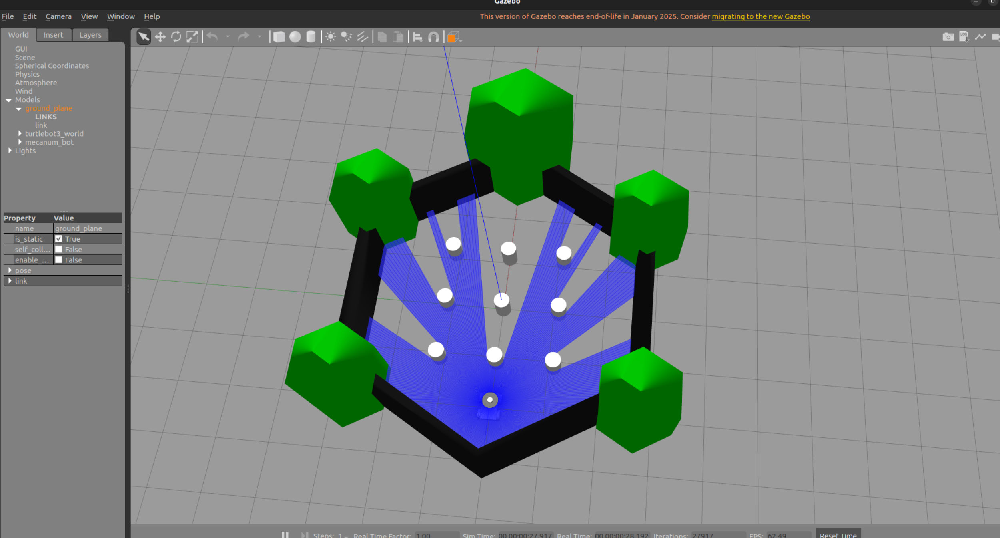
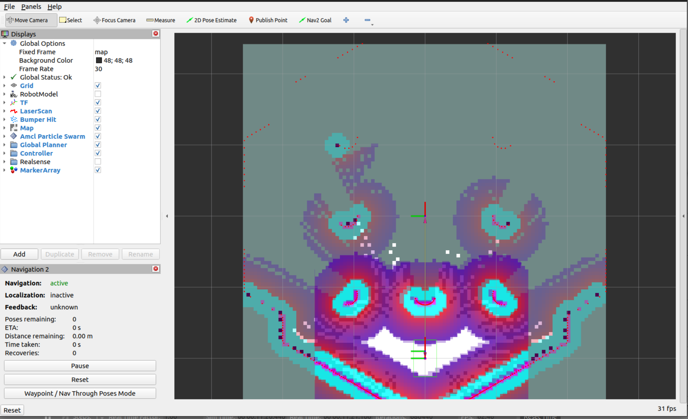
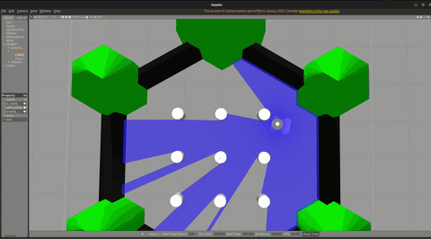
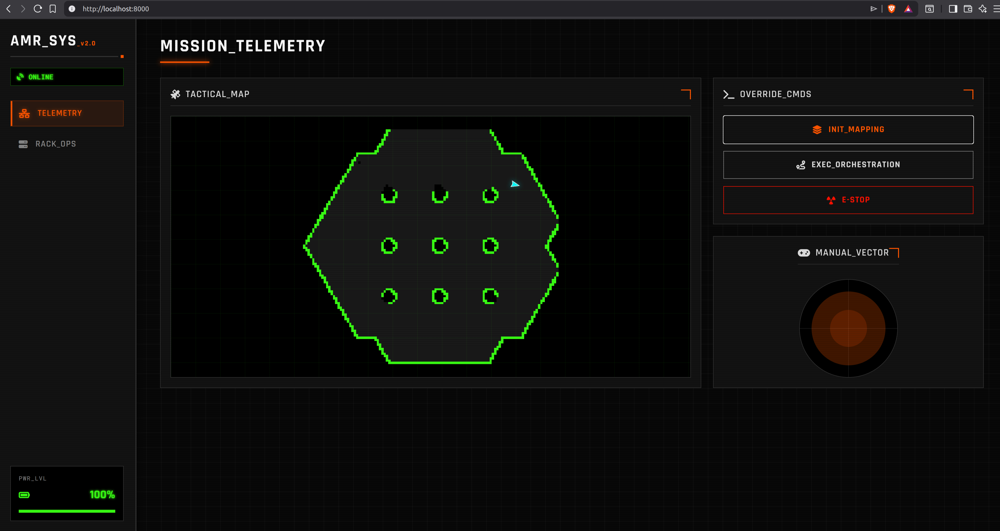
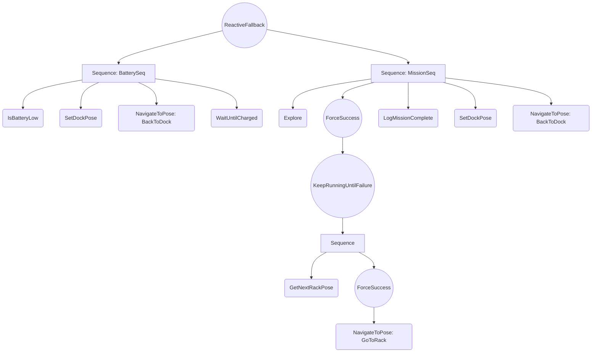

# Autonomous Mobile Robot (AMR) Architecture

This package contains the simulation environment, autonomous navigation stack, and mission orchestration for a custom Autonomous Mobile Robot (AMR). The robot features an omnidirectional mecanum drive, 2D LiDAR, and a highly tuned Nav2 stack capable of dynamic obstacle avoidance and autonomous frontier exploration. The entire warehouse logistics mission is seamlessly orchestrated by a robust Behavior Tree (BT.CPP).

It is pre-configured to run in **Gazebo** but is fully compatible with **NVIDIA Isaac Sim** via the ROS 2 OmniGraph bridge.

> **Branches:** `main` targets **ROS 2 Humble** (Gazebo Classic + BehaviorTree.CPP v3), exactly as below.
> `jazzy` targets **ROS 2 Jazzy** (new Gazebo "Harmonic"/gz sim + BehaviorTree.CPP v4) — see
> [Notes for the `jazzy` branch](#notes-for-the-jazzy-branch) at the bottom for what changed and
> how it was verified.

---

## System Dependencies

This architecture is built on **ROS 2 Humble**. Ensure you have the ROS 2 Humble desktop version installed before proceeding.

You will need the following ROS 2 packages to run the full simulation, mapping, and navigation stack:
```bash
sudo apt install ros-humble-navigation2 \
                 ros-humble-nav2-bringup \
                 ros-humble-slam-toolbox \
                 ros-humble-nav2-collision-monitor \
                 ros-humble-gazebo-* \
                 ros-humble-behaviortree-cpp-v3 \
                 ros-humble-rosbridge-suite
```

## Workspace Setup

Clone this repository into your ROS 2 workspace `src` directory, then build and source it. *(Using `--symlink-install` is highly recommended so Python script changes take effect without needing to rebuild).*
```bash
cd ~/AMR_ws
colcon build --symlink-install
source install/setup.bash
```

---

## Running the Autonomous Warehouse Mission (Without Web GUI)

The core feature of this AMR is its fully autonomous warehouse mission. The robot explores the warehouse, maps the environment, detects storage racks using computer vision, navigates to each rack for inspection, and finally returns to its docking station.

To run this complete mission manually from the terminal, you will need to open **three separate terminals** and run the following commands in order. *(Remember to run `source install/setup.bash` in every new terminal!)*

### 1. Core Simulation and Navigation Stack
This master launch file brings up Gazebo, spawns the mecanum AMR, and starts both SLAM Toolbox and Nav2.
```bash
ros2 launch robot_gazebo Core_Navigation.launch.py
```
<p align="center">
  
  
</p>
<p align="center"><i>Left: TurtleBot3 warehouse environment in Gazebo. Right: RViz2 visualizing Nav2 costmaps and SLAM.</i></p>

### 2. Behavior Tree Mission Executor
This C++ node orchestrates the mission sequence. It manages battery monitoring, launches `explore_lite` for exploration, and sequentially handles rack navigation.
```bash
ros2 run robot_Behavior robot_behavior --ros-args -p use_sim_time:=true
```
<p align="center">
  
</p>
<p align="center"><i>The 2D occupancy grid map generated by SLAM Toolbox, prior to OpenCV processing.</i></p>

### 3. Map Operations (Computer Vision Rack Detection)
This node runs in the background. It waits for the Behavior Tree to finish exploring and saving the map. It then uses OpenCV to detect all storage racks and publishes their coordinate waypoints back to the BT.
```bash
ros2 run robot_navigation map_operation_node
```
<p align="center">
  
</p>
<p align="center"><i>The AMR autonomously navigating to detected racks.</i></p>

---

## Running the Autonomous Warehouse Mission (With Web GUI)

This project includes an Industrial Sci-Fi themed web dashboard for remote control and real-time mission monitoring. Instead of launching the Behavior Tree and Map Operations manually from terminals, you can launch everything centrally from your web browser!

<p align="center">
  
</p>

### 1. Launch the Core Simulation
In your first terminal, launch the Gazebo simulation and Nav2 stack:
```bash
ros2 launch robot_gazebo Core_Navigation.launch.py
```

### 2. Launch the Web GUI Dashboard
Open three more terminals to bring up the ROS bridge, backend Python bridge, and local web server:

```bash
# Terminal A: Start the ROS bridge
ros2 run rosbridge_server rosbridge_websocket

# Terminal B: Start the GUI backend bridge node
python3 src/Warehouse_AMR/web_gui/gui_node.py

# (Simulation only) publish a battery level so PWR_LVL isn't "--%"
ros2 run robot_gazebo battery_dummy_node

# Terminal C: Host the frontend on a local web server
cd src/Warehouse_AMR/web_gui/
python3 -m http.server 8000
```
Then navigate to **[http://localhost:8000](http://localhost:8000)** in your web browser.

### 3. Mission Execution via Dashboard
Once the dashboard loads, you can use the interactive buttons on the left panel to control the entire mission:

- **Step 1: INIT_MAPPING**: Click this to automatically spawn the C++ Behavior Tree node (`robot_behavior`) in the background. The robot will begin autonomously exploring the warehouse to build the 2D map.
- **Step 2: EXEC_ORCHESTRATION**: Once **MISSION_PHASE** shows `MAP SAVED - READY FOR ORCHESTRATION`, click this to spawn the computer vision node (`map_operation_node`). It will scan the map for racks and publish the waypoints back to the robot. (Clicked earlier, it asks for confirmation: the node would read the previous run's map file.)
- **Mission Progress**: The dashboard will natively render the 2D Occupancy Grid map in real-time, overlaying the robot's live Odometry location as a neon cyan cursor and the detected rack waypoints as numbered diamonds (orange = pending, green = visited). **MISSION_PHASE** follows the mission (exploring → returning to origin → map saved → racks detected → visiting racks k/N → complete / e-stopped), **MISSION_LOG** shows the mission nodes' log messages, and the **RACK OPS** tab checks off each rack as it is visited.
- **E-STOP (Emergency Stop)**: Click this at any time to instantly halt all autonomous operation. It kills the background Behavior Tree and Map Operation processes (including the `explore_lite` they started), cancels every active Nav2 navigation goal, and publishes zero velocity. Nav2 stays up, so you can continue afterwards.

---

## Detailed Component Reference

### `Core_Navigation.launch.py`
**Purpose**: The master launch file.
**Functionality**: Seamlessly groups the Gazebo world loading, parses the URDF to spawn the custom mecanum robot, launches `slam_toolbox` in `online_async` mode for real-time occupancy grid mapping, and boots up the `nav2_bringup` stack alongside RViz2.

### `robot_behavior` (Behavior Tree Node)
**Purpose**: The central mission "Brain".
**Functionality**: Parses `warehouse_operation.xml` using `behaviortree_cpp_v3`. It manages a reactive sequence that constantly checks the battery. Its main sequence launches `explore_lite` natively in C++, waits for exploration to finish, waits for the `map_operation_node` to send it a list of rack coordinates, loops through those coordinates using Nav2, and then navigates back to the origin dock pose.

**Mission Logic Tree**:

```mermaid
graph TD
    Root((ReactiveFallback))
    
    %% Battery Interrupt Branch (High Priority)
    Root --> BatterySeq[Sequence: BatterySeq]
    BatterySeq --> IsBatteryLow(IsBatteryLow)
    BatterySeq --> SetDockPose1(SetDockPose)
    BatterySeq --> BackToDock1(NavigateToPose: BackToDock)
    BatterySeq --> WaitUntilCharged(WaitUntilCharged)
    
    %% Main Mission Branch (Normal Priority)
    Root --> MissionSeq[Sequence: MissionSeq]
    MissionSeq --> Explore(Explore)
    MissionSeq --> FS1((ForceSuccess))
    FS1 --> KR((KeepRunningUntilFailure))
    KR --> RackSeq[Sequence]
    RackSeq --> GetNextRackPose(GetNextRackPose)
    RackSeq --> FS2((ForceSuccess))
    FS2 --> GoToRack(NavigateToPose: GoToRack)
    
    %% Final Docking Sequence
    MissionSeq --> LogMissionComplete(LogMissionComplete)
    MissionSeq --> SetDockPose2(SetDockPose)
    MissionSeq --> BackToDock2(NavigateToPose: BackToDock)
```

### `map_operations.py`
**Purpose**: Computer vision and waypoint generation.
**Functionality**: Reads the `.yaml` and `.pgm` map files generated by SLAM. It applies OpenCV thresholds and area filters (excluding small noise and large outer walls) to isolate the storage racks. It then transforms the pixel coordinates into real-world ROS coordinates, applies a 0.55m offset to keep the robot safely in the aisle, calculates a quaternion to make the robot face the rack, and publishes a `PoseArray` to the BT.

---

## Connecting to NVIDIA Isaac Sim

This Nav2 stack is hardware-agnostic. To run this navigation stack using an NVIDIA Isaac Sim robot instead of Gazebo, your Isaac Sim **Action Graph (OmniGraph)** must act as the bridge.

Ensure your Isaac Sim graph contains the following ROS 2 nodes to satisfy Nav2's requirements:

1. `ROS 2 Publish Clock` (Set to "Read Sim Time"). *Crucial to prevent TF dropouts.*
2. `ROS 2 Publish Odometry` -> `ROS 2 Publish Raw Transform Tree` (Computes and broadcasts `odom` -> `base_link`).
   - `ROS 2 Publish Transform Tree` (Broadcasts static sensor offsets like `base_link` -> `lidar_link`).
3. `ROS 2 Publish LaserScan` (Attached to a PhysX Lidar on the robot).
4. `ROS 2 Subscribe Twist` (Listening to `/cmd_vel`). Wire the Y-axis (linear.y) output directly into your mecanum wheel controllers to enable strafing.

---

## Acknowledgments & Citations

This project builds upon the incredible work of the open-source robotics community:

- **Nav2 (Navigation2)**: Macenski, S., et al. "The Marathon 2: A Navigation System". 2020. [Nav2 GitHub](https://github.com/ros-planning/navigation2)
- **SLAM Toolbox**: Macenski, S., Campanile, I. "SLAM Toolbox". 2019. [SLAM Toolbox GitHub](https://github.com/SteveMacenski/slam_toolbox)
- **BehaviorTree.CPP**: Faconti, D. "BehaviorTree.CPP v3". [BehaviorTree.CPP GitHub](https://github.com/BehaviorTree/BehaviorTree.CPP)
- **TurtleBot3 Simulation World**: ROBOTIS Co., Ltd. [TurtleBot3 Simulations](https://github.com/ROBOTIS-GIT/turtlebot3_simulations)
- **m-explore-ros2 (`explore_lite`)**: [m-explore-ros2 GitHub](https://github.com/robo-friends/m-explore-ros2).
  Only `explore` (`explore_lite`) and `explore_lite_msgs` are vendored here; the multi-robot
  `map_merge` package and the upstream docs/tests were removed as unused.

---

## Notes for the `jazzy` branch

This branch is a port of the Humble version above to **ROS 2 Jazzy** (Ubuntu 24.04). The two
things Jazzy actually breaks — Gazebo Classic and BehaviorTree.CPP v3 — no longer exist as
packages on this distro, so both were replaced rather than just recompiled. Everything else
(Nav2, SLAM Toolbox, `explore_lite`, the OpenCV rack-detection node, the web GUI) is unchanged
and should behave the same — except that Nav2's own Jazzy parameter changes had to be applied
to `nav2_params.yaml` (see below).

### Dependencies
```bash
sudo apt install ros-jazzy-navigation2 \
                 ros-jazzy-nav2-bringup \
                 ros-jazzy-slam-toolbox \
                 ros-jazzy-nav2-collision-monitor \
                 ros-jazzy-ros-gz \
                 ros-jazzy-behaviortree-cpp \
                 ros-jazzy-rosbridge-suite
```

### What changed
- **Simulator**: Gazebo Classic (`gazebo_ros`) → new Gazebo "Harmonic" (`ros_gz_sim` / `ros_gz_bridge`).
  - `robot_description/urdf/robot.urdf`: the `libgazebo_ros_planar_move.so` controller is now the
    gz-sim `VelocityControl` + `OdometryPublisher` system pair — the direct equivalent of planar
    move (commanded twist is applied to the base, holonomic, so strafing works). gz-sim's
    `MecanumDrive` was tried and rejected: with these plain-cylinder wheels (no roller friction
    model) the wheels slip in place and its wheel odometry reports motion that never happens.
    The LiDAR and IMU are now plain `gz sim` sensor declarations with `<gz_frame_id>` set, so
    `/scan` and `/imu` are stamped `lidar_link` / `imu_link` (without it gz uses a scoped name
    like `mecanum_bot/base_footprint/lidar_sensor`, because the fixed joints get merged).
  - `robot_gazebo/worlds/turtlebot3_world.world`: `model://sun` / `model://ground_plane` are
    written out explicitly (gz sim has no bundled model DB to resolve those short URIs from), and
    the four world-level system plugins gz sim needs to actually step physics and render sensors
    (`Physics`, `Sensors`, `Imu`, `UserCommands`, `SceneBroadcaster`) are now declared explicitly.
  - New file `robot_gazebo/config/gz_bridge.yaml` + a `ros_gz_bridge parameter_bridge` node in
    every launch file that starts Gazebo: `cmd_vel`, `odom`, `tf`, `scan`, `imu`, and `clock` now
    cross the Gazebo Transport ↔ ROS 2 boundary through this bridge instead of a `gazebo_ros`
    plugin doing it inline.
  - `GZ_SIM_RESOURCE_PATH` is set in the launch files (replaces `GAZEBO_MODEL_PATH`) so
    `model://turtlebot3_world` still resolves to `robot_gazebo/models/`. `robot_gazebo/setup.py`
    now installs `models/` with its folder structure intact (the old `models/*/*/*` glob only
    installed the two `.dae` meshes, flattened, so gz sim couldn't find the model and the world
    failed to load).
- **Behavior Tree**: `behaviortree_cpp_v3` → `behaviortree_cpp` (v4) in `robot_Behavior`.
  - `#include <behaviortree_cpp_v3/bt_factory.h>` → `<behaviortree_cpp/bt_factory.h>`.
  - `BT::NodeConfiguration` → `BT::NodeConfig` in every custom node's constructor.
  - `tree.tickRoot()` → `tree.tickOnce()`.
  - `warehouse_operation.xml` now declares `BTCPP_format="4"` on `<root>`.
  - The hardcoded `/opt/ros/humble/lib/libnav2_*_bt_node.so` plugin paths and the
    `source /opt/ros/humble/setup.bash` calls in the `Explore` node now point at `/opt/ros/jazzy`.

- **Nav2 params** (`robot_gazebo/config/nav2_params.yaml`, `robot_navigation/config/nav2_params.yaml`):
  - Plugin names use the Jazzy `::` form (`nav2_navfn_planner::NavfnPlanner`,
    `nav2_behaviors::Spin`, ...). The Humble `pkg/Class` names no longer exist and made
    `planner_server` fail to configure, aborting the whole Nav2 bringup.
  - `bt_navigator`: the Humble `plugin_lib_names` list is gone (built-in BT plugins load
    automatically on Jazzy); `navigators` are declared instead.
  - Added `collision_monitor`, `docking_server` and `route_server` sections (from Jazzy's stock
    `nav2_params.yaml`): Jazzy's `navigation_launch.py` always starts these under the lifecycle
    manager. The velocity chain is now
    `controller_server → cmd_vel_nav → velocity_smoother → cmd_vel_smoothed → collision_monitor → cmd_vel`.
  - The collision monitor's `FootprintApproach` zone is shipped **disabled** (pass-through, same as
    Humble, which had no collision monitor): enabled, it zeroes every command once an obstacle is
    inside the footprint — including the spin/backup recoveries — and the robot deadlocked next to
    a rack pillar during testing. Set `enabled: True` to use it.

### Mission / tooling fixes (found while running the full mission on Jazzy)
- `explore_lite` (`m-explore-ros2/explore/src/explore.cpp`): when exploration finished it sent
  "cancel all goals" and the return-to-origin goal back-to-back; Nav2 could accept the return goal
  first and then cancel it too, so the robot never returned, `returned_to_origin` was never
  published and the Behavior Tree waited forever. The return goal is now sent from the cancel
  response callback, and a failed return is retried (3 attempts).
- `explore_lite` also used "cancel **all** goals" when stopping; cancels are server-wide, so when
  the BT shut explore_lite down after mapping it cancelled the BT's own first rack goal (rack 1
  was silently skipped). It now cancels only the goal it sent itself.
- `explore_lite` ignored a goal Nav2 *rejected* (e.g. its first goal, sent while `bt_navigator`
  was still activating): it treated the frontier as "still pursuing", never resent it, and
  blacklisted it after `progress_timeout`. A rejected goal is now resent on the next plan.
- SLAM: the sim launch files now use `config/slam_params.yaml` (stock Jazzy async params with
  `minimum_travel_distance`/`minimum_travel_heading` 0.2 instead of 0.5, `max_laser_range` 12).
  With the stock 0.5 m, slam_toolbox only adds a scan every ~0.9 m of travel and never on
  rotation, so in this small world explore_lite could reach nearby frontiers without the map
  changing, blacklist them, and stop with the map mostly unknown (0 racks detected). This
  happened on some runs and not others.
- Nav2 footprint (`robot_gazebo/config/nav2_params.yaml`): it covered only the 0.5 × 0.3 m
  chassis, but the wheels stick out to y = ±0.205 m, so strafing past a pillar clipped it. In gz
  sim that contact tilts the robot ~3.5°, the lidar (0.18 m up) then sees the floor ~3 m away,
  and SLAM smeared phantom walls across the map (planner failures, racks not detected). The
  footprint is now 0.52 × 0.42 m. `robot_navigation/config/nav2_params.yaml` (real robot / Isaac)
  still has the old chassis-only footprint — widen it too if the real wheels also stick out.
- `explore_lite` return-to-origin race: the return goal was sent as soon as Nav2 *accepted* the
  cancel of the last frontier goal, i.e. before that goal had actually stopped. Nav2 then treated
  it as a preemption and could report it SUCCEEDED when the controller reached the end of the
  old frontier path, 3+ m from the start. explore_lite now waits for the old goal to terminate,
  and only accepts a "succeeded" return if the robot is within 0.5 m of its initial pose
  (otherwise it retries).
- `map_operations.py` rack detection used `cv2.RETR_EXTERNAL`. When the unknown area fully
  enclosed the explored map (most maps), the racks were nested contours and none were found
  (0 racks). It now uses `RETR_LIST`; the existing area and rack-grid filters drop the rest.
- `robot_behavior` map save: `map_saver_cli` waits only 2 s for `/map` by default and sometimes
  timed out ("Failed to spin map subscription"); the BT carried on without a map file and
  `map_operation_node` waited for it forever. It now uses `save_map_timeout:=10.0` and retries
  up to 3 times.
- `robot_behavior`: no more hardcoded `/home/aadil/AMR_ws` paths — the tree XML is installed to
  `share/robot_Behavior/trees`, and the workspace / map folder are derived from the install
  location (override with `-p workspace:=`, `-p map_save_dir:=`, `-p tree_file:=`). It also waits
  for Nav2's `navigate_to_pose` server instead of crashing when started before Nav2 is up.
  `map_operation_node` derives its default `map_path` the same way, so both agree.
- Web GUI: `web_gui/lib/` (roslib, eventemitter2, nipplejs, Font Awesome) was never committed
  because the Python `.gitignore` template ignores `lib/`, so the dashboard couldn't load on a
  fresh clone. The libraries are now vendored and un-ignored. `gui_node.py` starts
  `robot_behavior` with `use_sim_time` matched to whether `/clock` is published, and the E-STOP
  now cancels Nav2 goals directly (it used to call a non-existent `nav2_manager` lifecycle service,
  so an active Nav2 goal kept driving the robot after the BT was killed).
- Web GUI ↔ mission (found testing the dashboard through rosbridge):
  - The rack list stayed on "AWAITING_DATA", and the BT never got the racks when
    `map_operation_node` was started from the dashboard: it publishes once (latched) about 1 s
    after starting, before DDS discovery matched the existing *volatile* subscribers. The BT now
    subscribes transient_local, and the dashboard subscribes with an explicit transient_local QoS.
  - Racks were never checked off: "Popped a rack" was logged with a standalone
    `rclcpp::get_logger()` logger, which does not publish to `/rosout`. It now uses a child of the
    node's logger.
  - Every rosbridge reconnect re-ran the dashboard setup: a second joystick, and every button
    click published once per reconnect. UI setup now runs once; only subscriptions are redone.
  - New: MISSION_PHASE and MISSION_LOG panels, rack waypoints drawn on the map, rack progress
    summary, buttons disabled while offline, joystick streams at 10 Hz while held, confirmation
    before EXEC_ORCHESTRATION when no map was saved this session, map rescales on window resize.
- Wheel joint states are published (gz `JointStatePublisher` + bridge) so the RViz robot model
  has no missing wheel transforms; the TurtleBot3 world's Gazebo-Classic material scripts were
  replaced with plain colours (gz sim ignores the scripts).
- `robot_navigation/launch/Exploration.launch.py` crashed on start (`DeclareLaunchArgument()`
  with its arguments commented out); `use_sim_time` is declared again (default `false`, real
  robot) and passed to SLAM, Nav2, explore_lite and RViz.
- `hardware/amr.service` sources `/opt/ros/jazzy`.

### Verified on Jazzy
Checked on Ubuntu 24.04 + ROS 2 Jazzy + Gazebo Harmonic (gz-sim 8.15):
- `colcon build` of the whole workspace succeeds (all 7 packages).
- `robot_world.launch.py`: world + robot load, `/clock`, `/odom`, `/tf`, `/scan` (`lidar_link`),
  `/imu` (`imu_link`) all publish; `cmd_vel` drives forward, strafes and yaws, and `/odom`
  matches Gazebo's ground-truth pose.
- `Core_Navigation.launch.py`: SLAM + Nav2 come fully up ("Managed nodes are active") and a
  `NavigateToPose` goal requiring a sideways move finishes with `SUCCEEDED`.
- `Exploration.launch.py`: `explore_lite` connects to Nav2 and drives the robot around the map.
- Full autonomous mission (`Core_Navigation.launch.py` + `robot_behavior` +
  `map_operation_node`): explore → return to origin → map saved → racks detected → every rack
  visited → back to dock → "Mission fully complete". With the SLAM/footprint/explore/rack
  detection fixes above, 3 consecutive headless runs each mapped the whole world, detected all
  9 racks, visited every one and docked (before them, about 1 run in 3 ended with 0 racks).
- Web GUI backend (`gui_node.py`, driven via its `/gui/*` topics): INIT_MAPPING starts the mission
  with `use_sim_time:=true`, and E-STOP cancels an active Nav2 goal and the robot stays stopped.
  All dashboard assets (`web_gui/lib/...`) are served.
- Web GUI end to end in a headless Chromium through `rosbridge_websocket`: ONLINE status, battery,
  live map + robot marker, joystick drives the robot, INIT_MAPPING → map saved →
  EXEC_ORCHESTRATION → 9 racks listed and all checked off → docked, rosbridge restarted mid-test
  (dashboard reconnects, no duplicated joystick/commands), E-STOP during exploration stops the
  robot. No browser console errors.
- `/joint_states` (wheel joints) is bridged and the wheel TFs resolve.

Tip: if Gazebo crashes or can't talk to the bridge on your machine, `export GZ_IP=127.0.0.1`
before launching.

Not covered here: the real-robot launch files (hardware not available for testing). They also
need `sllidar_ros2` and `micro_ros_agent` in your workspace — build them from source for Jazzy
(`micro_ros_agent` via `micro_ros_setup`).

### `hardware/` (ESP32 micro-ROS firmware)
`hardware/cmd_vel_sub/cmd_vel_sub.ino` is unaffected by the two things that actually break on
Jazzy (no Gazebo, no BehaviorTree.CPP), and its C code is unchanged here. What it does need before
flashing against a Jazzy agent:
- Rebuild/reinstall `micro_ros_arduino` against the Jazzy message set (`geometry_msgs/Twist`,
  `nav_msgs/Odometry`, `sensor_msgs/Imu` are regenerated per-distro even though the wire protocol
  and rclc API haven't changed).
- Run the micro-ROS agent from `ros-jazzy` instead of Humble's.
- Reflash the ESP32 with the rebuilt library.

`hardware/ESP_motorTester/ESP_motorTester.ino` is plain Arduino/Modbus with no ROS dependency at
all — unaffected either way.
